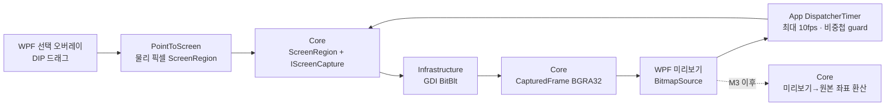

# M2.1 캡처·좌표·실시간 갱신 흐름

- App은 화면 캡처 API를 직접 호출하지 않는다.
- Infrastructure는 `IScreenCapture`를 구현하고 Core만 참조한다.
- App은 이전 백그라운드 캡처가 끝난 뒤에만 다음 갱신을 시작한다. 새 선택·미리보기 닫기·캡처 실패는 갱신을 중단한다.
- 실제 포인터 입력과 입력 세션 상태 전이는 이 흐름에 포함하지 않는다.
