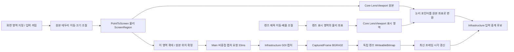

# M5 두 창 캡처·좌표 흐름

- 원본 테두리만 Source를 바꾸며, 렌즈 이동·배율은 Destination만 바꾼다.
- 처음에는 테두리만 표시한다. `이 영역 확대` 확정 뒤 렌즈·캡처·입력을 열며 원본을 재배치하지 않는다. 선택 취소는 대기 중인 확대 작업도 무효화한다.
- 두 창과 제어부는 캡처 제외를 요청한다. 렌즈의 입력 통과는 별도 중계 경로이며 캡처 제외로 대체하지 않는다.
- Main은 이전 캡처가 끝나야 다음 요청을 처리한다. 영역 변경·복귀 이후 도착한 이전 프레임은 버린다.
- 캡처 실패는 입력을 일시 정지하고 프레임을 지운다. 조작 요청이 남아 있으면 후속 캡처 성공과 물리 해제 확인 뒤 재개한다. 750ms 갱신 지연도 일시 정지한다.
- 33ms 요청·16ms 포인터 표시 갱신은 설정값이며 실측 fps·지연이 아니다.
- App은 Core 계약을 호출하고 Win32 캡처·입력 구현은 Infrastructure에 둔다.
- 2026-09-12 영역 지정·드래그 유지 수정은 사용자 “아주 잘됨” 확인을 받았다. 겹침·재귀·혼합 DPI까지 개별 검증된 것은 아니다.
