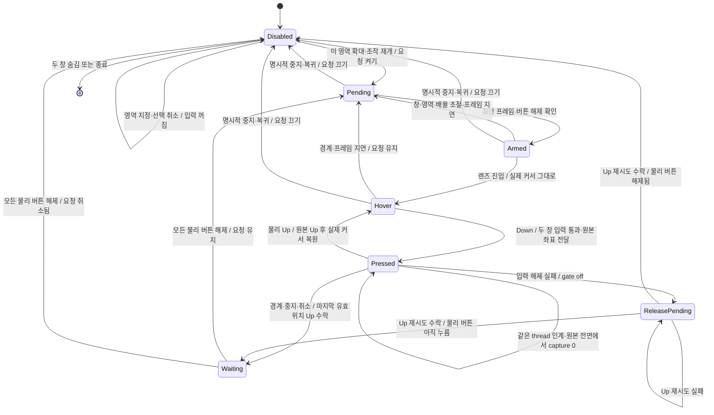

# M5 직접 입력 세션 상태도

- 확대 열기 자체가 조작 요청이다. 일시 정지는 요청을 유지하며, 물리 버튼 해제와 최신 프레임을 확인한 뒤 자동으로 Armed가 된다. 명시적 중지·복귀·입력 실패로 요청이 취소됐으면 자동 재개하지 않는다.
- 정상 종료·경계 모두 Up 뒤에만 실제 커서를 렌즈 쪽으로 복원한다. Waiting에서는 이전 누름의 추가 클릭·Up 전달을 억제한다. 드래그 중 커서를 복원하면 추가 pressed Move가 대상에 전달됨을 진단으로 확인했다.
- Stop/취소에는 capture 손실·닫기·Esc·입력 실패·화면 구성 변경·프레임 지연도 포함한다. 물리 버튼이 이미 해제됐다면 Waiting을 거치지 않는다.
- 중계되지 않은 WPF 창 손잡이 누름은 창 조절로 입력을 꺼도 Waiting을 만들지 않아 Thumb capture를 유지한다. 실제 대상 누름이 있으면 이 예외를 적용하지 않고 Up·해제 대기를 유지한다. 어느 경로든 물리 버튼을 누른 채 재무장할 수 없다.
- Up 실패는 누름 상태를 보존한다. 명시적 StopAsync는 미해제 오류를 반환하며, 성공한 복귀로 처리하지 않는다.
- 직접 조작은 WPF mouse capture를 사용하지 않는다. 전용 스레드가 상태를 소유한다. hook callback은 원본 억제 여부를 반환하고 주입·창 스타일 변경은 반환 뒤 FIFO 큐에서 수행한다. UI는 최신 상태를 표시한다.
- capture 감시는 원본 thread에서 조회한다. 같은 thread의 다른 root 인계나 원본 전면 유지 중 0만으로 Up을 보내지 않는다. 조회 실패·원본 닫힘은 중지하며, 관찰한 capture의 외부 thread 전환 또는 capture=0과 무관한 전면 전환이 함께 확인돼도 중지한다.
- A/B는 별도 PointerInputSession이다. 도구를 열면 직접 중계를 끄고 별도 허용·카운트다운 뒤 단일 획을 실행한다. 도구를 닫으면 열기 전 요청을 재개하되, 중간에 명시적으로 중지했다면 재개하지 않는다.
- 이 상태도는 구현을 설명한다. 2026-09-12 영역 지정·드래그 유지 수정은 사용자 확인을 받았다. 이중 포인터·경계/오류별 복귀 등 별도 항목은 남아 있다. [최신 확인 기록](../../notes/runs/2026-09-12-region-selection-drag-confirmed.md)을 따른다.
