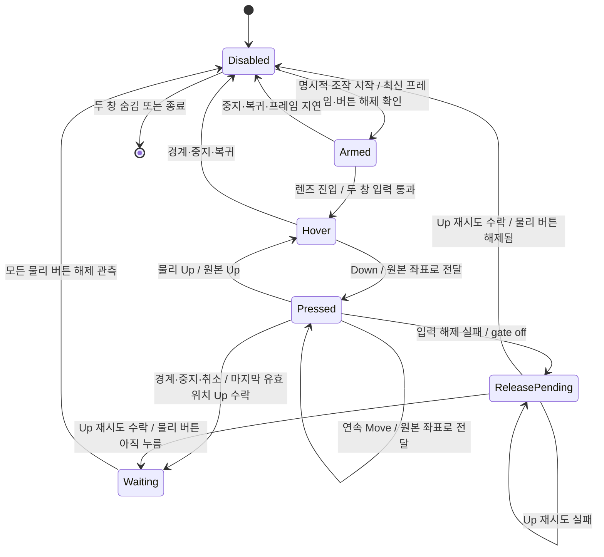

# M5 직접 입력 세션 상태도

- 재진입도 Disabled다. 물리 버튼을 놓은 사실만으로 Armed가 되지 않는다.
- 경계 Up 뒤에만 커서를 렌즈 쪽으로 복원한다. Waiting에서는 이전 누름의 추가 클릭·Up 전달을 억제한다.
- Stop/취소에는 capture 손실·닫기·Esc·입력 실패·화면 구성 변경·프레임 지연도 포함한다. 물리 버튼이 이미 해제됐다면 Waiting을 거치지 않는다.
- Up 실패는 누름 상태를 보존한다. 명시적 StopAsync는 미해제 오류를 반환하며, 성공한 복귀로 처리하지 않는다.
- 직접 조작은 WPF mouse capture를 사용하지 않는다. 전용 hook 스레드가 상태를 소유하고 UI는 최신 상태를 표시한다.
- A/B는 별도 PointerInputSession이다. 접힌 도구를 열면 직접 중계를 끄고, 별도 허용·카운트다운 뒤 렌즈를 잠시 숨겨 단일 획을 실행한다. 취소·완료 뒤 A/B 허용도 끈다.
- 이 상태도는 코드의 의도와 API 수락 상태를 설명한다. native Down 한 번 이후 프로브가 중단됐으므로 실제 연속 전달·최종 Up·마우스 복귀는 NEEDS_USER_UI_CHECK다.
