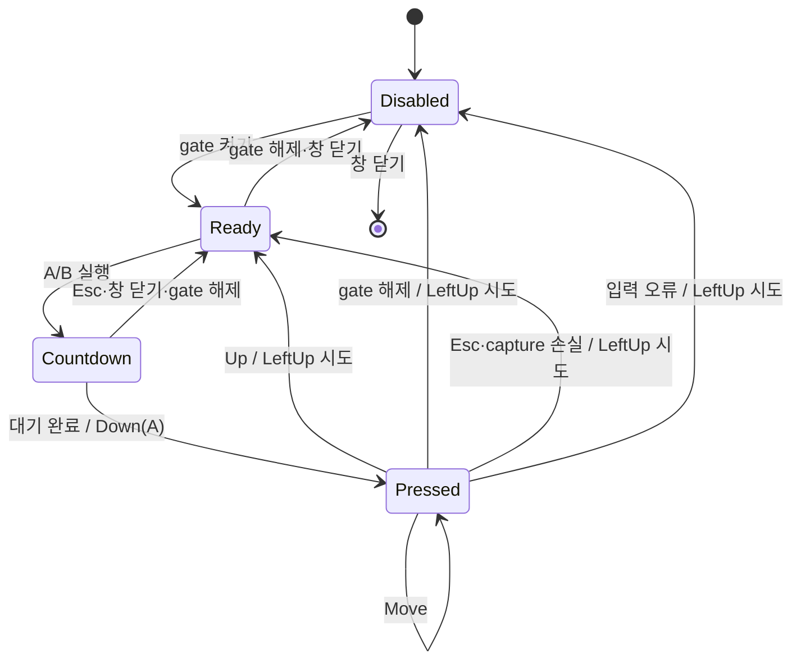

# M3 입력 세션 상태도

- `Disabled`가 기본 상태다. 이 상태의 미리보기 클릭과 A/B 지정은 Windows 입력을 호출하지 않는다.
- `Countdown`은 아직 포인터를 누르지 않은 대기 상태다. 취소하면 `Ready`로 돌아가며 실제 획을 시작하지 않는다.
- `Countdown → Pressed`의 A→B 실행은 미리보기 창을 잠시 숨긴 뒤 선택한 `ScreenRegion`의 전역 화면 좌표로 `Down(A)`를 보낸다. 대상 창 핸들은 선택하거나 제한하지 않는다.
- 현재 App은 A/B 실행만 `Pressed`로 전이한다. 확대 미리보기의 실시간 Down → Move → Up 조작은 M5의 미해결 차단 사항이며, 별도 모드 설계 뒤에 이 상태도에 추가한다.
- `Pressed`를 끝내는 모든 경로는 `LeftUp`을 한 번 시도한다.
- UIPI 등 Windows가 입력을 거부한 원인은 API 결과만으로 확정할 수 없으므로 App은 성공처럼 표시하지 않는다.
