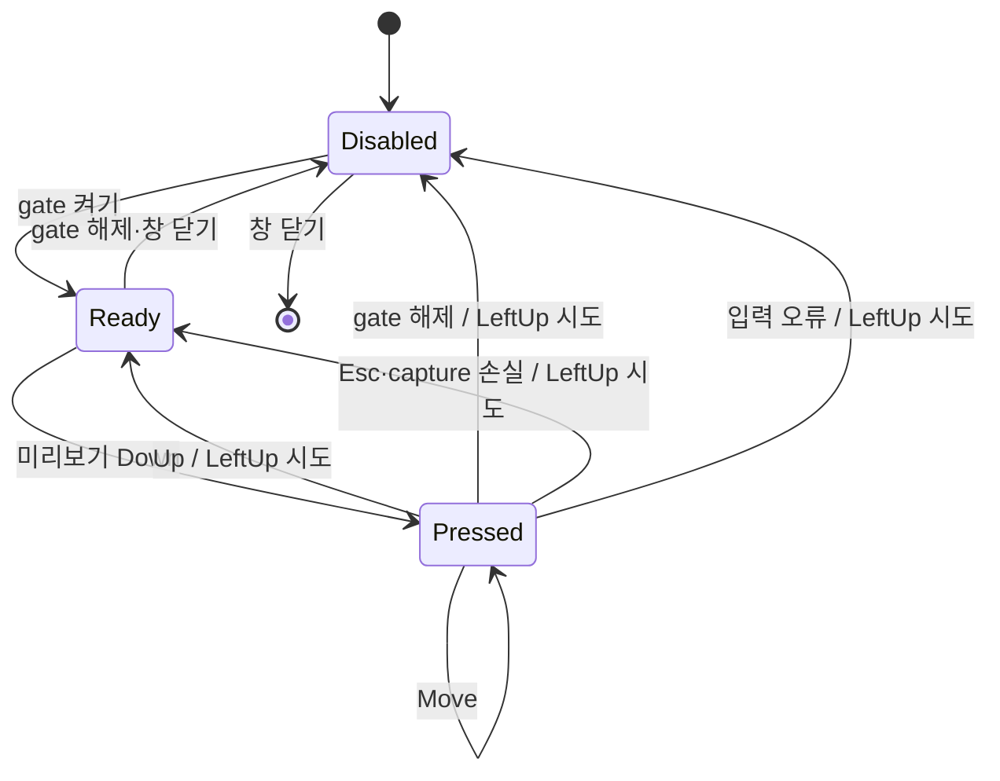

# M3 입력 세션 상태도

```mermaid
stateDiagram-v2
    [*] --> Disabled
    Disabled --> Ready: gate 켜기
    Ready --> Pressed: 미리보기 Down
    Pressed --> Pressed: Move
    Pressed --> Ready: Up / LeftUp 시도
    Pressed --> Disabled: gate 해제 / LeftUp 시도
    Pressed --> Ready: Esc·capture 손실 / LeftUp 시도
    Pressed --> Disabled: 입력 오류 / LeftUp 시도
    Ready --> Disabled: gate 해제·창 닫기
    Disabled --> [*]: 창 닫기
```

- `Disabled`가 기본 상태다. 이 상태의 미리보기 드래그는 Windows 입력을 호출하지 않는다.
- `Pressed`를 끝내는 모든 경로는 `LeftUp`을 한 번 시도한다.
- UIPI 등 Windows가 입력을 거부한 원인은 API 결과만으로 확정할 수 없으므로 App은 성공처럼 표시하지 않는다.
